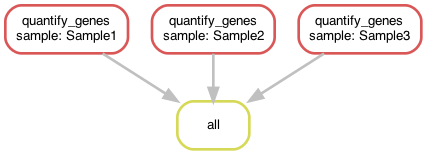

# Exercise01
**[Tutorial Chapter 01: Introduction](https://fennaf.gitbook.io/bfvh4dsp1/01-introduction/exercise)**


## About this exercise
Purely testing about how to create a Snakefile and how to run the pipeline using different options/parameters.


## Workflow DAG visualisation
Visualisation of the [Directed Acyclic Graph (DAG)](https://en.wikipedia.org/wiki/Directed_acyclic_graph) of the workflow:  



## Pipeline file structure
```
Exercise01
├── data
│   └── *
├── results
│   └── *
├── workflow
│   └── Snakefile
├── README.md
└── dag.png
```


## Installation
Follow general installation instructions from the [README located in the repository root](https://github.com/Vincent-Talen/Dataprocessing-Snakemake-Assignments#installation).


## Usage
To run this workflow/pipeline open a terminal with the working directory as the directory of this exercise.  
Activate the environment by running the following command (if your environment is named differently replace `dataprocessing` with that name):
```bash
mamba activate dataprocessing
```
After the environment is activated the pipeline can be run by simply invoking snakemake:
```bash
snakemake -c 1
```
The `-c` or `--cores` option specifies the amount of cores you want snakemake to use, when given no value it will select the system maximum.

### Different options for running the snakemake workflow
* `--dry-run` or `-n`: shows what the execution plan is. Combined with `p` so it also prints the shell commands for better illustration of the plan.  
    ```bash
    snakemake -np
    ```
* `--delete-all-output`: deletes all created output files  
    ```bash
    snakemake -c --delete-all-output
    ```
* `--list`: lists all available rules in the workflow
    ```bash
    snakemake --list
    ```
* `--summary`: lists a summary of files created by the workflow
    ```bash
    snakemake --summary
    ```

### Re-generating the workflow DAG visualisation
The visualisation of the DAG can be created with the following command:
```bash
snakemake --forceall --dag | dot -Tpng > dag.png
```


## Contact
For support or any other questions, do not hesitate to contact me at v.k.talen@st.hanze.nl
