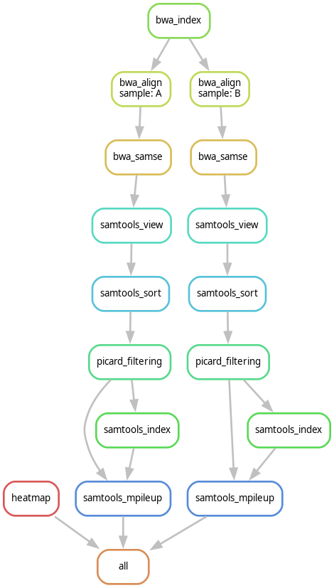

# Exercise04
**[Tutorial Chapter 04: Using external scripts](https://fennaf.gitbook.io/bfvh4dsp1/04-using-external-scripts/exercises)**

------
## About this exercise
????


------
## Workflow DAG visualisation
Visualisation of the [Directed Acyclic Graph (DAG)](https://en.wikipedia.org/wiki/Directed_acyclic_graph) of the workflow:  



------
## Pipeline file structure
```
Exercise04
├── config
│   └── config.yaml
├── results
│   ├── A.out.vcf
│   ├── B.out.vcf
│   └── heatmap.jpg
├── workflow
│   ├── rules
│   │   ├── aligning.smk
│   │   ├── filtering.smk
│   │   ├── heatmap.smk
│   │   ├── pileup.smk
│   │   └── sorting.smk
│   ├── scripts
│   │   └── heatmap.R
│   └── Snakefile
├── README.md
└── dag.png
```


------
## Installation
Follow general installation instructions from the [README located in the repository root](https://github.com/Vincent-Talen/Dataprocessing-Snakemake-Assignments#installation).

This exercise does require additional installation steps before it can be run, since the [Picard](https://github.com/broadinstitute/picard) tool is necessary.

### Gradle + OpenJDK 17
To be able to build and use Picard, [Gradle](https://gradle.org/) and [OpenJDK](https://openjdk.org/) 17 are required.
Make sure these are already installed on your system with the correct versions, if not follow the instructions from https://openjdk.org/install/ and https://gradle.org/install/.

### Picard
After making sure Gradle and OpenJDK 17 are installed, go to the directory Picard should be installed in.
Run the following command to clone the Picard repository to your system and change the working directory to the cloned git directory:
```bash
git clone https://github.com/broadinstitute/picard.git
cd picard/
```
Now the fully-packaged executable Picard jar with all its dependencies should be built using the gradlew wrapper:
```bash
./gradlew shadowJar
```
The only thing left to do is to update the `picard-path` variable in the `config/config.yaml` file to the correct path `picard.jar` is built.
Replace `path_to_picard_directory` with the correct path to the cloned picard directory and keep the `build/libs/picard.jar` behind it.
> picard-path: /<path_to_picard_directory>/build/libs/picard.jar


------
## Usage
### config.yaml
Before running all variables in the `config/config.yaml` file should be checked and updated if needed.
All directories should end with a trailing `/`, since the rules concatenate just the file names.

### Running the pipeline
To run this workflow/pipeline open a terminal with the working directory as the directory of this exercise.  
Activate the environment by running the following command (if your environment is named differently replace `dataprocessing` with that name):
```bash
mamba activate dataprocessing
```
After the environment is activated the pipeline can be run by simply invoking snakemake:
```bash
snakemake -c 1
```
The `-c` or `--cores` option specifies the amount of cores you want snakemake to use, when given no value it will select the system maximum.

### Different options for running the snakemake workflow
* `--dry-run` or `-n`: shows what the execution plan is. Combined with `p` so it also prints the shell commands for better illustration of the plan.  
    ```bash
    snakemake -np
    ```
* `--delete-all-output`: deletes all created output files  
    ```bash
    snakemake -c --delete-all-output
    ```
* `--list`: lists all available rules in the workflow
    ```bash
    snakemake --list
    ```
* `--summary`: lists a summary of files created by the workflow
    ```bash
    snakemake --summary
    ```

### Re-generating the workflow DAG visualisation
The visualisation of the DAG can be created with the following command:
```bash
snakemake --forceall --dag | dot -Tpng > dag.png
```


------
## Contact
For support or any other questions, do not hesitate to contact me at v.k.talen@st.hanze.nl
