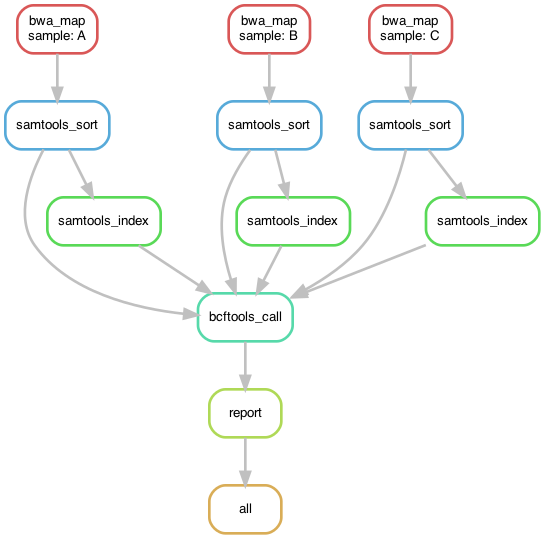

# Exercise05
**[Tutorial Chapter 05: Scheduling and logging](https://fennaf.gitbook.io/bfvh4dsp1/05-scheduling-and-logging/exercises)**

------
## About this exercise
Learning about cpu's, cores, threads and more to increase performance of the pipeline whilst also implementing benchmarking and logging.
The bigger part of this tutorial chapter however is to learn how to run the pipeline on a slurm cluster to divide the tasks.


------
## Workflow DAG visualisation
Visualisation of the [Directed Acyclic Graph (DAG)](https://en.wikipedia.org/wiki/Directed_acyclic_graph) of the workflow:  



------
## Pipeline file structure
```
Exercise05
├── config
│   └── config.yaml
├── slurm
│   └── config.yaml
├── workflow
│   └── Snakefile
├── README.md
└── dag.png
```


------
## Installation
Follow general installation instructions from the [README located in the repository root](https://github.com/Vincent-Talen/Dataprocessing-Snakemake-Assignments#installation).


------
## Usage
### config.yaml
Before running all variables in the `config/config.yaml` file should be checked and updated if needed.
All directories should end with a trailing `/`, since the rules concatenate just the file names.

### Running the pipeline
To run this workflow/pipeline open a terminal with the working directory as the directory of this exercise.  
Activate the environment by running the following command (if your environment is named differently replace `dataprocessing` with that name):
```bash
mamba activate dataprocessing
```
After the environment is activated the pipeline can be run by simply invoking snakemake:
```bash
snakemake -c 1
```
The `-c` or `--cores` option specifies the amount of cores you want snakemake to use, when given no value it will select the system maximum.

### Running pipeline over Slurm cluster
Snakemake can run pipelines on Slurm clusters for you, to easily to this a profile has been included in this repository.
If not run on the Hanze bioinformatics cluster the 'partition' name in `slurm/config.yaml` should be replaced.
To run the pipeline over the slurm cluster run the following command that uses the settings from the 'slurm' profile:
```bash
snakemake --profile slurm
```

### Different options for running the snakemake workflow
* `--dry-run` or `-n`: shows what the execution plan is. Combined with `p` so it also prints the shell commands for better illustration of the plan.  
    ```bash
    snakemake -np
    ```
* `--delete-all-output`: deletes all created output files  
    ```bash
    snakemake -c --delete-all-output
    ```
* `--list`: lists all available rules in the workflow
    ```bash
    snakemake --list
    ```
* `--summary`: lists a summary of files created by the workflow
    ```bash
    snakemake --summary
    ```

### Re-generating the workflow DAG visualisation
The visualisation of the DAG can be created with the following command:
```bash
snakemake --forceall --dag | dot -Tpng > dag.png
```


------
## Contact
For support or any other questions, do not hesitate to contact me at v.k.talen@st.hanze.nl
